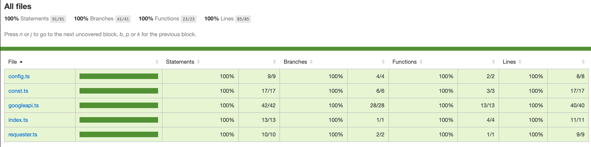

# Information 
## Changes
- Switch to use purely typescript but babel.
- Setup code base with eslint for linting, audit
- Refactor code (a bit) :), prefer to use arrow function for consistency
- CI pipeline (using Github Action). It will publish package when merging PR to `main` branch (`dry-run` only, no worry :))
- End-to-end test and unit test
- Remove `yarn`, use `npm` instead

## Testing
- Add end-to-end test
- Add unit test

## Notice
- Personally I do not think using the Google API Key to make real request to Google for end-to-end test is the appropriate way. Instead, I would suggest to use https://www.npmjs.com/package/nock instead. The component itself should be isolated.

## Issues Found
I found some of the issues in the code as below
- No `await` when calling a function that return a Promise
```ts
// In the index.ts file, line 7
const res = getPlaceAutocomplete(process.env.GOOGLE_PLACE_API_KEY, address).then(async (autocompleteResults) => {
  const res = []
  return res
})
```
- Wrong logic assertion
```ts
// places.test.ts line 15
it('can fetch from the autocomplete api', async () => {
  const res = await getAutoCompleteDetails('50 McDougall Street, Milton')
  const firstRes = res[0];
  expect(firstRes).toHaveProperty('suggestion')
  // the `components` is the breakdown of each suggestion. Not sure why it should be the same level with `suggestion`
  // also `components` stands an array but here is objection assertion
  expect(firstRes).toHaveProperty('components')
  expect(firstRes.components).toHaveProperty('unit')
  expect(firstRes.components).toHaveProperty('street_number')
  expect(firstRes.components).toHaveProperty('street_name')
  expect(firstRes.components).toHaveProperty('suburb')
  expect(firstRes.components).toHaveProperty('state')
  expect(firstRes.components).toHaveProperty('postcode')
  expect(firstRes.components).toHaveProperty('country')
})
```

## Code coverage


## Setup in your local
```sh
# to install packages
npm install 

# to run test
npm run test

# to check linting
npm run lint

# to check audit (production only)
npm run audit
```

## Something fun that we can think of
- Use `semver` and `semantic-release` to control the package version and the release process (with git tag) automatically

--------

Scenario:
=========

A developer of ours was recently integrating into Google Places API when Dogecoin mooned.
They committed this repo with a partial integration and some testcases before jumping into their new lambo and driving off into the sunset.

We are pretty confident the developer managed to complete the majority of the initial part of the integration, however there might be a bug or two to be discovered.

Your task is to finish off this implementation, ensuring the requirements are met with passing tests.

Task:
=====
To take a partial address input and return full address suggestions along with the address broken into its individual components using the Google Maps API.


Resources:
==========

Autocomplete Documentation: https://developers.google.com/maps/documentation/places/web-service/autocomplete
Place Documentation: https://developers.google.com/maps/documentation/places/web-service/details

Install:
========
1. yarn install

Test:
=====
1. yarn install
2. yarn test


Requirements:
=============

1. All tests should pass and ensure good coverage for new work
2. We only allow Australian addresses to be returned
3. Code should be maintainable and consistent
4. The main library function should return a native Promise which resolves to an array of results
5. The result element should contain both the completed suggestion and also the suggestion broken down into its components (unit, street number, street name, suburb, state, postcode, country)
6. The returned result should be typed and easily consumable via users of the library
7. No front-end requirements are necessary, this is purely a backend NodeJS library
